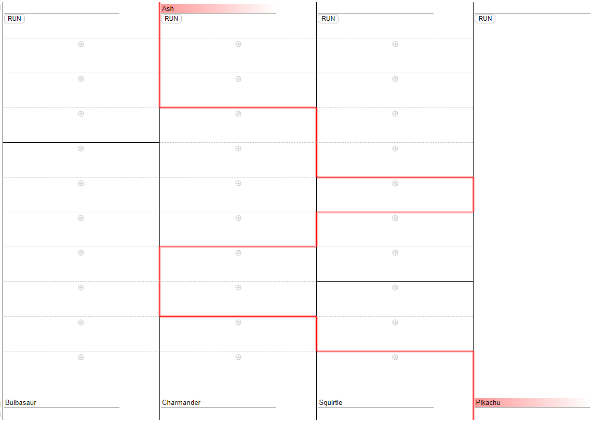

# Ghost Legs

## Description

Ghost Legs is a tool that matches subjects at the top to options at the bottom. Adding bridges between columns alters matching results.

## Implementation

Using HTML table, hosted on [GitHub Page](https://mckingho.github.io/ghost-legs/)

# Accessibility

## Keyboard users

It is fully supported. All clickable `div` in this page can be focused by `Tab` key, with `Enter` and `Space` keypress handled.

## Screen reader users

It is not supported. The main board is now hidden with `aria-hidden` attribute. Rendering with changing table cell border color is the key of this tool to show routes. Welcome to suggest me any improvement.

# Demonstration

